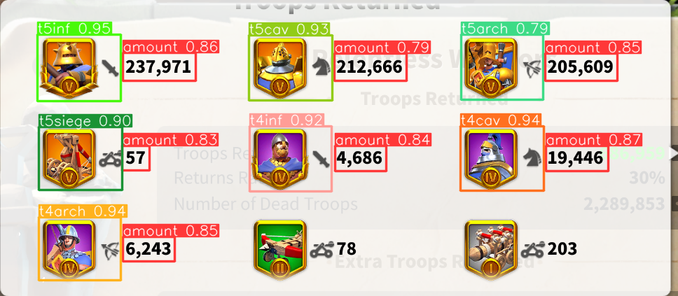

# Rise of Kingdoms deads bot

This tool is made in purpose of automating gathering and storing data for dead troops (KVK) in Rise of Kingdoms. It utilizes discord dev tools and YOLOv8 for data gathering and processing.

An example on the YOLOv8 model prediction on an image, after the image was processed.

These detections are then turn into "troop type - amount" -pairs, and the amounts of dead troops can be read with OCR.

Process ends with storing the data into desired location, which at the moment is a google sheets document.
